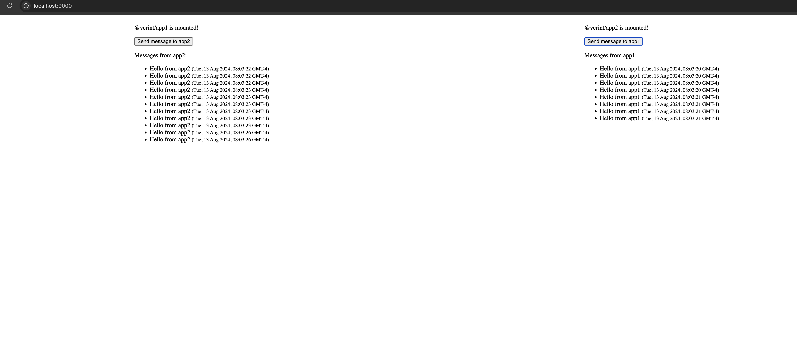

# Single-Spa React Micro-Frontend Application

## Project Overview



This project demonstrates a micro-frontend architecture using [Single-Spa](https://single-spa.js.org/) with React. It consists of a root configuration and two independent React applications (`app1` and `app2`) that communicate with each other via an event bus implemented with RxJS.

### Features

- **Micro-frontend architecture**: Managed by Single-Spa to run multiple micro-frontends.
- **React with TypeScript**: Both micro-frontends are built using React and TypeScript.
- **RxJS for Communication**: Apps communicate with each other using an RxJS-based event bus.
- **Reusable Components**: Shared components are used across the micro-frontends.
- **Dockerized Deployment**: Each micro-frontend and the root config are containerized using Docker.
- **Automated Testing**: Basic unit tests are provided for both micro-frontends using Jest and React Testing Library.

## Table of Contents

- [Installation](#installation)
- [Usage](#usage)
  - [Running Locally](#running-locally)
  - [Running using Docker](#running-docker)
  - [Running Tests](#running-tests)

## Installation

### Prerequisites

- Node.js (version 16 or higher)
- npm or Yarn package manager
- Docker (for containerized deployment)

## Installation

1. Clone the repository.

```bash
git clone https://github.com/Brianfan0829/verint-single-spa-test.git
cd single-spa-react-app
```

## Usage

### Running Locally

To run the application locally, follow these steps:

```bash
cd utils
npm install
npm start

cd app1
npm install
npm start

cd app2
npm install
npm start

cd root-config
npm install
npm start

```

Please make sure utils is running on port 8500 and app1 is on 8501 and app2 is on 8502

Open http://localhost:9000 in your web browser to view the application with both micro-frontends loaded.

### Running docker

To run the application using docker, follow these steps:
make sure docker is running on your machine

```bash
docker-compose up
```

### Running Tests

Unit tests are provided for both micro-frontends. To run the tests:
Run Tests for App1

```bash
cd app1
npm test
...
```
